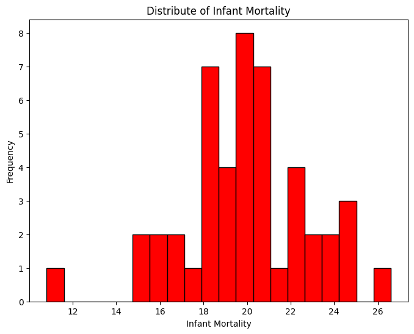
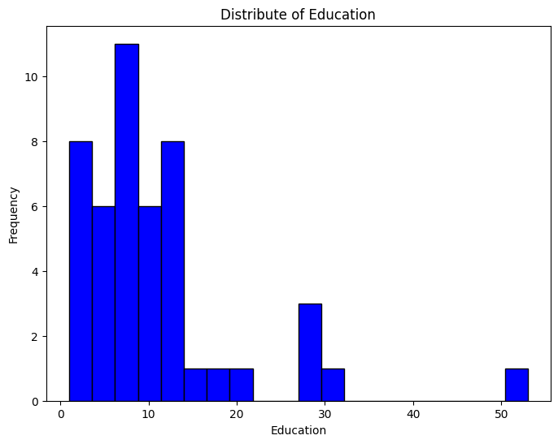
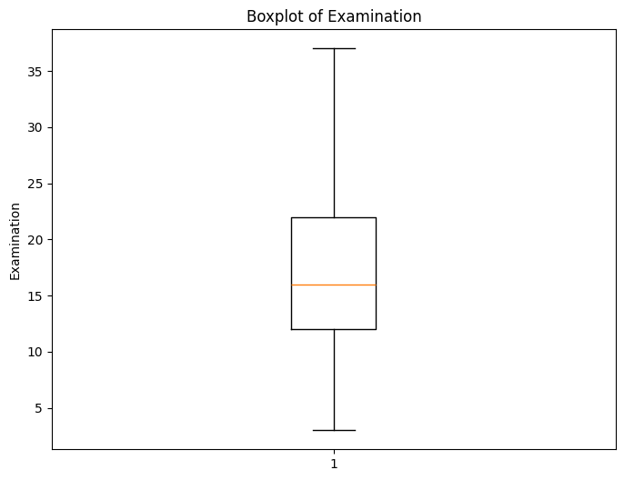
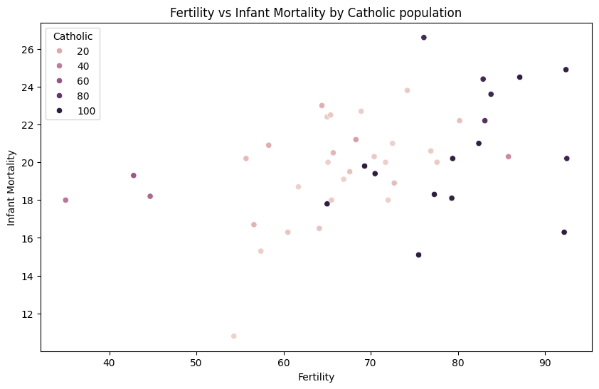

```python
import pandas as pd
swiss_df = pd.read_csv('swiss_datasets.csv')
print(swiss_df.info())
print(swiss_df.describe())
```

    <class 'pandas.core.frame.DataFrame'>
    RangeIndex: 47 entries, 0 to 46
    Data columns (total 6 columns):
     #   Column            Non-Null Count  Dtype  
    ---  ------            --------------  -----  
     0   Fertility         47 non-null     float64
     1   Agriculture       47 non-null     float64
     2   Examination       47 non-null     int64  
     3   Education         47 non-null     int64  
     4   Catholic          47 non-null     float64
     5   Infant.Mortality  47 non-null     float64
    dtypes: float64(4), int64(2)
    memory usage: 2.3 KB
    None
           Fertility  Agriculture  Examination  Education   Catholic  \
    count  47.000000    47.000000    47.000000  47.000000   47.00000   
    mean   70.142553    50.659574    16.489362  10.978723   41.14383   
    std    12.491697    22.711218     7.977883   9.615407   41.70485   
    min    35.000000     1.200000     3.000000   1.000000    2.15000   
    25%    64.700000    35.900000    12.000000   6.000000    5.19500   
    50%    70.400000    54.100000    16.000000   8.000000   15.14000   
    75%    78.450000    67.650000    22.000000  12.000000   93.12500   
    max    92.500000    89.700000    37.000000  53.000000  100.00000   
    
           Infant.Mortality  
    count         47.000000  
    mean          19.942553  
    std            2.912697  
    min           10.800000  
    25%           18.150000  
    50%           20.000000  
    75%           21.700000  
    max           26.600000  
    


```python
import matplotlib.pyplot as plt
plt.figure(figsize=(8,6))
plt.hist(swiss_df['Infant.Mortality'].dropna(), bins=20, color='red', edgecolor='black')
plt.title('Distribute of Infant Mortality')
plt.xlabel('Infant Mortality')
plt.ylabel('Frequency')
plt.show()
```


    

    


```python
plt.figure(figsize=(8,6))
plt.hist(swiss_df['Education'].dropna(), bins=20, color='blue', edgecolor='black')
plt.title('Distribute of Education')
plt.xlabel('Education')
plt.ylabel('Frequency')
plt.show()
```


    

    


```python
plt.figure(figsize=(8, 6))
plt.boxplot(swiss_df['Examination'].dropna())
plt.title('Boxplot of Examination')
plt.ylabel('Examination')
plt.show()
```


    

    


```python
import seaborn as sns

plt.figure(figsize=(10,6))
sns.scatterplot(x='Fertility', y='Infant.Mortality', hue='Catholic', data=swiss_df)
plt.title('Fertility vs Infant Mortality by Catholic population')
plt.xlabel('Fertility')
plt.ylabel('Infant Mortality')
plt.show()
```


    

    


```python
corr = swiss_df[['Catholic', 'Education', 'Infant.Mortality']].corr()
sns.heatmap(corr, annot=True, cmap='coolwarm')
plt.title('Correlation Matrix')
plt.show()
```


    

    


```python

```
