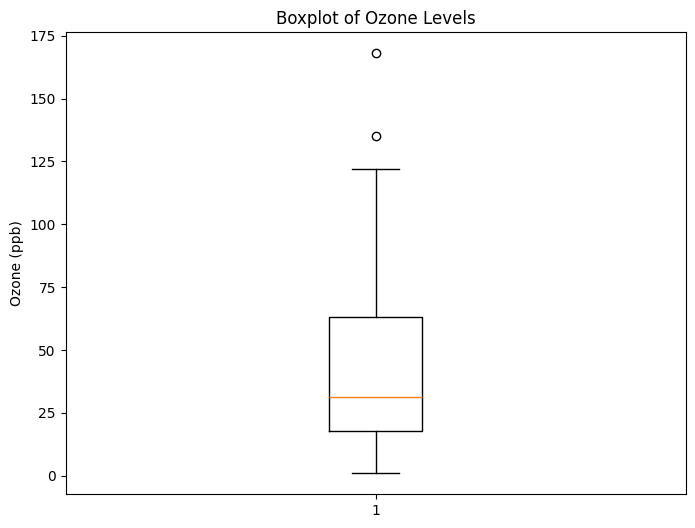

## This is markdown content

Here is a list

1. Item 1
2. Item 2
3. Item 3

**bold**
*italic*


```python
# First we activate the virtual environment (venv477) - it has all the required libraries already downloaded and installed
# In this code block, we'll be using numpy, a library to deal with numbers and complex calculations

import numpy as np
print(np.absolute(-1))
arr = np.array([1,2,3,4,5,])
print(arr)
```

    1
    [1 2 3 4 5]
    


```python
#lists are native to python
my_list = [1,2,3,4,5]
print(my_list)
```

    [1, 2, 3, 4, 5]
    


```python
#For dataframes, we use pandas library, which will be used for handling large amounts of data.
import pandas as pd
data={'Ozone': [41,36,12],'Temp':[67,72,74]}
df = pd.DataFrame(data)
print(df)
print(df.describe())
print(df.info())
```

       Ozone  Temp
    0     41    67
    1     36    72
    2     12    74
               Ozone       Temp
    count   3.000000   3.000000
    mean   29.666667  71.000000
    std    15.502688   3.605551
    min    12.000000  67.000000
    25%    24.000000  69.500000
    50%    36.000000  72.000000
    75%    38.500000  73.000000
    max    41.000000  74.000000
    <class 'pandas.core.frame.DataFrame'>
    RangeIndex: 3 entries, 0 to 2
    Data columns (total 2 columns):
     #   Column  Non-Null Count  Dtype
    ---  ------  --------------  -----
     0   Ozone   3 non-null      int64
     1   Temp    3 non-null      int64
    dtypes: int64(2)
    memory usage: 176.0 bytes
    None
    


```python
# Here we load the airquality dataset to start visualizing it.
airquality_df = pd.read_csv('airquality_datasets.csv')
print(airquality_df) # This will print out a concise version of the dataset
```

         Ozone  Solar.R  Wind  Temp  Month  Day
    0     41.0    190.0   7.4    67      5    1
    1     36.0    118.0   8.0    72      5    2
    2     12.0    149.0  12.6    74      5    3
    3     18.0    313.0  11.5    62      5    4
    4      NaN      NaN  14.3    56      5    5
    ..     ...      ...   ...   ...    ...  ...
    148   30.0    193.0   6.9    70      9   26
    149    NaN    145.0  13.2    77      9   27
    150   14.0    191.0  14.3    75      9   28
    151   18.0    131.0   8.0    76      9   29
    152   20.0    223.0  11.5    68      9   30
    
    [153 rows x 6 columns]
    


```python
print(airquality_df.info()) # This will print out the information of the dataframe.
```

    <class 'pandas.core.frame.DataFrame'>
    RangeIndex: 153 entries, 0 to 152
    Data columns (total 6 columns):
     #   Column   Non-Null Count  Dtype  
    ---  ------   --------------  -----  
     0   Ozone    116 non-null    float64
     1   Solar.R  146 non-null    float64
     2   Wind     153 non-null    float64
     3   Temp     153 non-null    int64  
     4   Month    153 non-null    int64  
     5   Day      153 non-null    int64  
    dtypes: float64(3), int64(3)
    memory usage: 7.3 KB
    None
    


```python
print(airquality_df.describe()) # This will print out some basic stats on the dataset
```

                Ozone     Solar.R        Wind        Temp       Month         Day
    count  116.000000  146.000000  153.000000  153.000000  153.000000  153.000000
    mean    42.129310  185.931507    9.957516   77.882353    6.993464   15.803922
    std     32.987885   90.058422    3.523001    9.465270    1.416522    8.864520
    min      1.000000    7.000000    1.700000   56.000000    5.000000    1.000000
    25%     18.000000  115.750000    7.400000   72.000000    6.000000    8.000000
    50%     31.500000  205.000000    9.700000   79.000000    7.000000   16.000000
    75%     63.250000  258.750000   11.500000   85.000000    8.000000   23.000000
    max    168.000000  334.000000   20.700000   97.000000    9.000000   31.000000
    


```python
# Now we can start creating visualizations
import matplotlib.pyplot as plt # This import will be used for plotting

# Ozone Histogram
plt.figure(figsize=(8, 6))
plt.hist(airquality_df['Ozone'].dropna(), bins=20, color='blue', edgecolor='black') #dropna() will drop all NA values
plt.title('Distribution of Ozone Levels')
plt.xlabel('Ozone (ppb)')
plt.ylabel('Frequency')
plt.show()
```


    

    


```python
# Temp Histogram
plt.figure(figsize=(8, 6))
plt.hist(airquality_df['Temp'].dropna(), bins=20, color='orange', edgecolor='black')
plt.title('Distribution of Temperature')
plt.xlabel('Temperature (°F)')
plt.ylabel('Frequency')
plt.show()
```


    

    


```python
# Boxplot for Ozone
plt.figure(figsize=(8, 6))
plt.boxplot(airquality_df['Ozone'].dropna())
plt.title('Boxplot of Ozone Levels')
plt.ylabel('Ozone (ppb)')
plt.show()
```


    

    


```python
# Boxplot for Temp
plt.figure(figsize=(8, 6))
plt.boxplot(airquality_df['Temp'].dropna())
plt.title('Boxplot of Temperature')
plt.ylabel('Temperature (°F)')
plt.show()
```


    

    


```python
import seaborn as sns

# Scatter plot with regression line
plt.figure(figsize=(10, 6))
sns.scatterplot(x='Temp', y='Ozone', hue='Month', data=airquality_df)
plt.title('Temperature vs Ozone Levels by Month')
plt.xlabel('Temperature (°F)')
plt.ylabel('Ozone (ppb)')
plt.show()
```


    

    


```python
# Correlation matrix
corr = airquality_df[['Ozone', 'Temp', 'Wind']].corr()
sns.heatmap(corr, annot=True, cmap='coolwarm')
plt.title('Correlation Matrix')
plt.show()
```


    

    


```python

```
