# Labor Market Dynamics Analysis - Samuel Zelaya

## Week 1 - 10/14 ~ 10/20

**Understanding labor market dynamics is essential for analyzing the nation's economic health. This analysis utilizes data from the Federal Reserve Economic Data (FRED) to explore significant variables that impact the U.S. labor market. so I compiled a series of variables and merged them together in an excel file containing The following key indicators that we will examine:**

-   Unemployment Rate
-   Employment Level
-   Labor Force Participation Rate
-   Average Hourly Earnings
-   Job Openings
-   Labor Force Participation Rate by Gender
-   Gross Domestic Product (GDP)
-   Labor Underutilization Measures

**By analyzing these variables, we aim to provide insights into the current state and long-term trends of the labor market, highlighting the interactions between these factors and their implications for policymakers, businesses, and job seekers.**

**Access Link: [FRED](https://fred.stlouisfed.org/)**

------------------------------------------------------------------------

### 1. Unemployment Rate

The Unemployment Rate (percent, seasonally adjusted) is a critical indicator of labor market conditions. The data is sourced from the U.S. Bureau of Labor Statistics as part of their Employment Situation report and is calculated monthly. Here's a breakdown of the key components:

-   **Access Link**:<https://fred.stlouisfed.org/series/UNRATE>
-   **Definition**: The unemployment rate represents the percentage of the labor force that is unemployed. It is calculated by dividing the number of unemployed individuals by the total labor force. This data is specific to individuals 16 years and older who reside in one of the 50 U.S. states or the District of Columbia. The population is limited to non-institutionalized individuals and those not serving in the armed forces.
-   **Seasonally Adjusted**: The adjustment accounts for predictable seasonal fluctuations, making the data more accurate for month-to-month comparisons.
-   **U-3 Measure**: This is the official unemployment rate as defined by the Bureau of Labor Statistics. It is also referred to as a measure of labor underutilization, focusing on people who are actively seeking and available for work.
-   **Significance**: As one of the most closely followed indicators, the unemployment rate helps assess the overall health of the economy. Changes in the rate can signal shifts in economic conditions, labor market tightness, or broader economic challenges.

### 2. Employment Level

The Employment Level (measured in thousands of persons and seasonally adjusted) is another important labor market indicator provided by the U.S. Bureau of Labor Statistics through its Employment Situation report. Here’s an overview of the key components:

-   **Access Link**: <https://fred.stlouisfed.org/series/CE16OV>
-   **Definition**: The employment level indicates the total number of employed persons in the civilian noninstitutional population. This population includes individuals who are 16 years and older and reside in one of the 50 U.S. states or the District of Columbia. It excludes individuals who are inmates of institutions (such as penal or mental facilities), those living in long-term care facilities, and those on active duty in the Armed Forces.
-   **Seasonally Adjusted**: Seasonal adjustments are made to account for regular seasonal variations in employment, allowing for more accurate comparisons across different months.
-   **Significance**: Tracking the employment level helps economists and policymakers gauge the health of the job market. An increasing employment level generally indicates economic growth and labor market strength, while a declining level may signal economic challenges.

### 3. Labor Force Participation Rate

The Labor Force Participation Rate (percent, seasonally adjusted) is a vital economic indicator that provides insights into the engagement of the working-age population in the labor market. Here’s a detailed overview:

-   **Access Link**: <https://fred.stlouisfed.org/series/CIVPART>
-   **Definition**: The Labor Force Participation Rate (LFPR) is defined as the percentage of the civilian noninstitutional population that is either employed or actively seeking employment. Specifically, it includes individuals aged 16 and older who reside in the 50 states or the District of Columbia, excluding those who are institutionalized or on active military duty.
-   **Seasonally Adjusted**: The data is seasonally adjusted to account for predictable fluctuations in labor force participation due to seasonal factors (like holidays or school schedules), allowing for more accurate month-to-month comparisons.
-   **Significance**: The LFPR is an important measure for economists, policymakers, and financial markets. It provides insights into the overall health of the economy. A rising participation rate can indicate increasing confidence in the job market, while a declining rate may suggest economic challenges or shifts in demographic trends.
-   **Long-Run Trends**: Changes in the LFPR over time can reflect broader economic and demographic trends. For example, an aging population may contribute to a decrease in the participation rate as more individuals retire and exit the labor force, which is not necessarily indicative of economic decline.

### 4. Average Hourly Earnings

The Average Hourly Earnings of Production and Nonsupervisory Employees (measured in dollars per hour and seasonally adjusted) is a key economic indicator that reflects wage trends in the private sector. Here’s a detailed overview:

-   **Access Link**: <https://fred.stlouisfed.org/series/AHETPI>
-   **Definition**:
    -   **Scope**: This measure includes the average hourly earnings for all production and related employees, as well as nonsupervisory employees in total private industries. It covers a wide range of occupations, including but not limited to:
        -   Production Employees: Those involved in fabricating, processing, assembling, inspecting, and related activities.
        -   Nonsupervisory Employees: This group encompasses individuals in private service-providing industries who do not hold supervisory roles. Examples include office and clerical workers, repairers, salespersons, drivers, nurses, teachers, custodial workers, and more.
-   **Seasonally Adjusted**: The figures are seasonally adjusted to account for regular fluctuations in employment and wage levels that occur throughout the year (e.g., holiday hiring or seasonal layoffs), making it easier to analyze month-to-month changes.
-   **Frequency**: Data is reported on a monthly basis, providing timely insights into wage trends.
-   **Significance**:
    -   **Wage Trends**: Average hourly earnings are crucial for understanding wage growth and inflationary pressures in the economy. Rising average hourly earnings can indicate a tightening labor market, where employers must raise wages to attract and retain workers.
    -   **Economic Indicator**: This measure is widely used by economists, policymakers, and financial analysts to gauge the overall health of the labor market and economic conditions. Higher wages typically lead to increased consumer spending, which is a significant driver of economic growth.

### 5. Job Openings

Job Openings (measured in thousands, seasonally adjusted) is a critical labor market indicator that provides insights into the demand for labor. Here’s an overview of the key elements:

-   **Access Link**: <https://fred.stlouisfed.org/series/JTSJOL>
-   **Definition**:
    -   **Total Nonfarm Job Openings**: This metric represents the total number of unfilled jobs on the last business day of the month across all nonfarm sectors. A job is classified as open if:
        -   A specific position exists and there is work available for it.
        -   The job can commence within 30 days.
        -   Active recruiting efforts are underway for the position.
-   **Seasonally Adjusted**: The data is seasonally adjusted to account for regular patterns in job openings that occur throughout the year, making it easier to analyze trends over time.
-   **Frequency**: The data is reported on a monthly basis, providing timely updates on job market conditions.
-   **Significance**:
    -   **Indicator of Labor Demand**: Job openings are a key indicator of unmet demand for labor and can reflect labor shortages. A high number of job openings suggests a tight labor market, where employers may struggle to find suitable candidates.
    -   **Economic Analysis**: Economists, government officials, and researchers use job openings data to gauge the overall health of the labor market. Increases in job openings can signal economic growth, while declines may indicate economic slowdowns or shifts in demand for certain types of labor.

### 6. Labor Force Participation Rate by Gender

**Labor Force Participation Rate - Men**

-   **Access Link**: <https://fred.stlouisfed.org/series/LNS11300001>
-   **Definition**: The percentage of men aged 16 and older who are either employed or actively seeking employment.
-   **Significance**:\
    The LFPR serves as a key economic indicator, reflecting the health of the labor market; higher rates generally suggest a robust economy. It also provides insights into policy effectiveness, highlights gender disparities in workforce engagement, and signals shifts in industry demand.

**Labor Force Participation Rate - Women**

-   **Access Link**: <https://fred.stlouisfed.org/series/LNS11300002>
-   **Definition**: The percentage of women aged 16 and older who are either employed or actively seeking employment.
-   **Significance**:\
    The LFPR is a crucial economic indicator, revealing insights about the labor market's health and women's engagement in the workforce. Changes in this rate can reflect shifts in economic conditions, societal norms, and policy effectiveness, providing a better understanding of gender dynamics in employment.

### 7. Gross Domestic Product (GDP)

The Gross Domestic Product (GDP) is a comprehensive measure of economic activity that reflects the total value of goods and services produced in a country. Here’s an overview:

-   **Access Link**: <https://fred.stlouisfed.org/series/GDP>
-   **Definition**: GDP is defined as the total market value of all final goods and services produced within a country's borders in a given time period, typically measured quarterly or annually.
-   **Components**: GDP can be expressed through three main approaches:
    -   **Production Approach**: Calculates GDP as the sum of the value added at each stage of production.
    -   **Income Approach**: Measures GDP as the total income earned by factors of production, including wages, profits, rents, and taxes, minus subsidies.
    -   **Expenditure Approach**: Computes GDP by adding up all expenditures made in the economy, including consumption, investment, government spending, and net exports.
-   **Seasonally Adjusted**: The data is seasonally adjusted to account for predictable fluctuations in economic activity throughout the year.
-   **Significance**:
    -   **Economic Health**: GDP is one of the most critical indicators of economic health, providing insights into the overall economic performance and growth trends. It reflects the strength or weakness of the economy, influencing policy decisions and investment strategies.
    -   **Comparison Across Time and Geography**: GDP enables comparisons of economic performance over time and between different countries, regions, or economic sectors.

### 8. Labor Underutilization Measures

Labor underutilization measures provide insights into various forms of labor market slack, reflecting the challenges faced by workers. The primary measures include:

**Access Link** : <https://www.bls.gov/lau/stalt.htm>

-   **U-1**: Persons unemployed for 15 weeks or longer, as a percentage of the civilian labor force.

-   **U-2**: Job losers and persons who completed temporary jobs, as a percentage of the civilian labor force.

-   **U-3**: The official unemployment rate, as defined by the Bureau of Labor Statistics.

-   **U-4**: Total unemployed plus discouraged workers, as a percentage of the civilian labor force plus discouraged workers.

-   **U-5**: Total unemployed, plus discouraged workers, plus all other persons marginally attached to the labor force, as a percentage of the civilian labor force plus all persons marginally attached to the labor force.

-   **U-6**: Total unemployed, plus all persons marginally attached to the labor force, plus total employed part-time for economic reasons, as a percentage of the civilian labor force plus all persons marginally attached to the labor force.

-   **Significance**: Labor underutilization measures provide a more comprehensive view of labor market conditions by accounting for individuals who are unemployed, underemployed, or discouraged from seeking work. They are vital for understanding the true state of the labor market and the challenges faced by various groups of workers.

------------------------------------------------------------------------

### 9. The 5Ws of Labor Market Dynamics

#### Who

The analysis involves key stakeholders, including:

-   **Policymakers**: Government officials making decisions on economic policies.
-   **Businesses**: Employers seeking to understand labor market conditions for strategic planning.
-   **Job Seekers**: Individuals searching for employment opportunities.
-   **Economists and Researchers**: Analysts studying labor market trends and implications.

#### What

The focus is on key labor market indicators, including:

1.  **Unemployment Rate**: Percentage of the labor force that is unemployed.
2.  **Employment Level**: Total number of employed persons in the civilian noninstitutional population.
3.  **Labor Force Participation Rate**: Percentage of the working-age population engaged in the labor market.
4.  **Average Hourly Earnings**: Wage trends in the private sector.
5.  **Job Openings**: Demand for labor represented by unfilled jobs.
6.  **Labor Force Participation Rate by Gender**: Employment engagement metrics disaggregated by gender.
7.  **Gross Domestic Product (GDP)**: Measure of overall economic activity.
8.  **Labor Underutilization Measures**: Insights into various forms of labor market slack.

#### When

The analysis will use data sourced from:

-   **Current Population Survey (CPS)**: Monthly data collected from about 60,000 households.
-   **Current Employment Statistics (Establishment Survey)**: Monthly employment and wage data.
-   **Job Openings and Labor Turnover Survey (JOLTS)**: Monthly data on job openings and labor turnover.
-   **Bureau of Economic Analysis (BEA)**: Quarterly and annual GDP data.

#### Where

The data pertains to:

-   The **United States**, specifically focusing on the labor market conditions within the 50 states and the District of Columbia.

#### Why

Understanding these labor market dynamics is vital for:

-   **Economic Health Assessment**: Evaluating the overall economy's performance.

-   **Policy Development**: Informing decisions on labor-related policies.

-   **Business Strategy**: Helping companies navigate labor market conditions for hiring and compensation strategies.

-   **Job Seekers**: Empowering individuals to make informed career choices based on market trends.

## Week 2 - 10/21 ~ 10/27 

### Introduction

In recent years, understanding economic indicators has become increasingly crucial for policymakers, researchers, and the general public. This document aims to analyze key economic metrics, including the unemployment rate and employment rate, utilizing data from the Federal Reserve Economic Data (FRED) database.

The focus of this analysis will be on trends over the past decade, highlighting significant fluctuations and their implications on the broader economy. By examining the relationships between the unemployment rate and employment rate, we aim to uncover insights that can inform future economic strategies.

Throughout this document, we will utilize visualizations and statistical analyses to present our findings clearly and concisely. The goal is to provide a comprehensive overview of the current economic landscape and to foster a deeper understanding of these vital indicators.

------------------------------------------------------------------------

### Unemployment

### 1. Yearly Data Trends from 2014 to 2024"

#### Overview

**The dataset presents the monthly unemployment rates in the United States from January 2014 to October 2024. This analysis identifies trends and significant changes in the unemployment landscape, particularly around economic events and policy responses.**

#### Key Insights:

**Long-term Decline (2014-2019):**

The unemployment rate shows a consistent decline from 6.6% in January 2014 to around 3.5% in December 2019. This trend indicates a strong recovery from the post-recession period, reflecting economic growth and improved job creation.

The lowest monthly rate recorded during this period was 3.5% in September 2019, suggesting that the economy was nearing full employment.

**Impact of the COVID-19 Pandemic (2020):**

A dramatic spike in the unemployment rate is observed in April 2020, where it peaked at 14.8%. This spike can be attributed to the widespread economic disruption caused by the COVID-19 pandemic and the resulting lockdowns. The rate remained elevated throughout 2020, with a total of 97.1% for the year, highlighting the severe impact of the pandemic on employment.

**Recovery Phase (2021-2024):**

In 2021, the unemployment rate began to decline again, reaching 3.9% by December 2024, indicating a recovery as businesses reopened and adapted to the new normal. The gradual decrease reflects ongoing economic recovery efforts, despite persistent challenges, with monthly rates fluctuating around 3.4% to 4.3% throughout 2023 and 2024.

**Recent Trends (2022-2024):**

The rates from 2022 onwards show stability with minor fluctuations, suggesting that the labor market is stabilizing. The monthly unemployment rates in 2023 and 2024 generally remain below 4.5%, demonstrating resilience in job recovery. The highest monthly rate in the recent years was 4.3% in July 2024, indicating that while fluctuations exist, they are not as severe as during the pandemic.

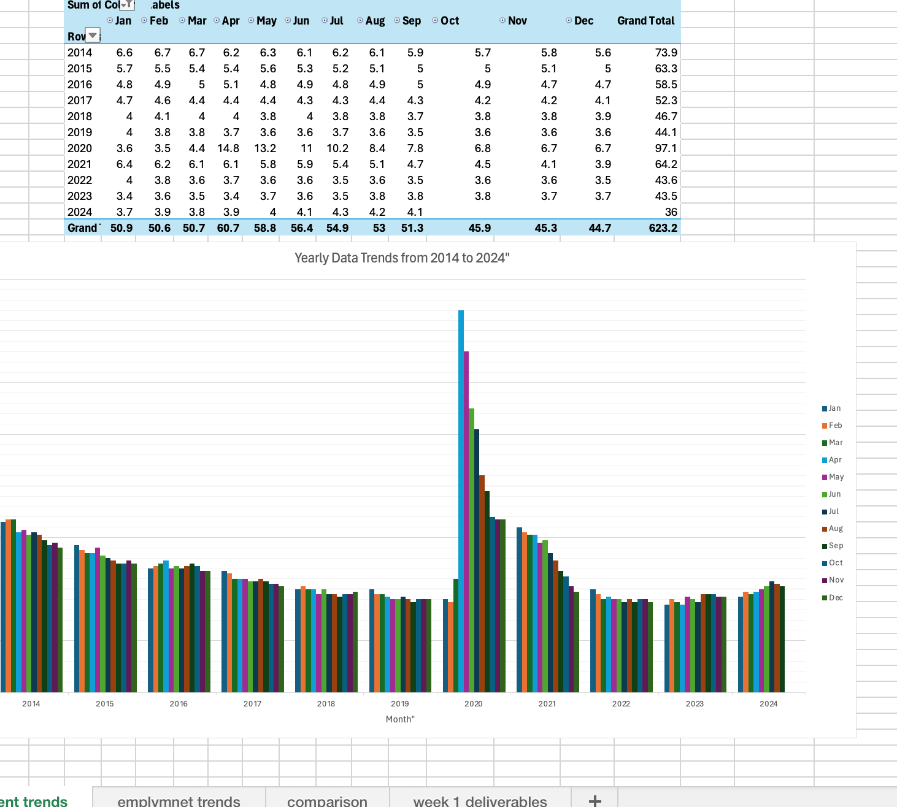

### 2. Annual UNRATE Summation from 2014 to 2024

#### Overview

**The table presents the annual sums of unemployment rates (UNRATE) for each year from 2014 to 2024. The analysis provides insights into the trends and significant fluctuations over the years, especially in relation to economic events such as the COVID-19 pandemic.**

#### Insights

**Overall Trend:**

The Grand Total of the unemployment rates from 2014 to 2024 is 623.2. This figure reflects the cumulative unemployment rates across the years, indicating the overall employment landscape during this period.

**Declining Unemployment Rates (2014-2019):** There is a consistent decline in the sum of unemployment rates from 73.9 in 2014 to 44.1 in 2019. This period shows a strong recovery and improvement in the labor market, aligning with economic growth and increasing job opportunities.

The lowest annual unemployment rate sum occurred in 2019, suggesting the economy was performing well before the pandemic.

**Impact of the COVID-19 Pandemic (2020):** The sum of 97.1 in 2020 is significantly higher than in previous years, illustrating the severe impact of the pandemic on the job market. This spike reflects the widespread layoffs and economic disruptions caused by lockdowns and reduced business activities. The increase in the unemployment rate in 2020 highlights the challenges faced by the labor market during this unprecedented crisis.

**Subsequent Recovery (2021-2024):** In 2021, the unemployment rate sum increased to 64.2, indicating a recovery as the economy began to reopen and businesses adjusted to new norms. However, this rate remains elevated compared to pre-pandemic levels. The subsequent years (2022-2024) show a notable decline in the sum of unemployment rates, with 43.6 in 2022, 43.5 in 2023, and 36 in 2024. This trend indicates a stabilization and recovery in the job market, approaching levels similar to those seen before the pandemic.

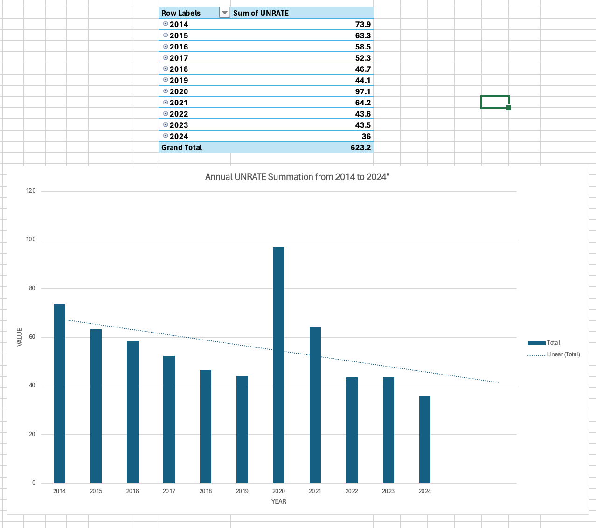

### 3.Monthly Sum of UNRATE from 2014 to 2024

##### Overview

This analysis examines the monthly unemployment rates from January 2014 to December 2024. By evaluating these rates, we can identify seasonal trends and significant shifts, particularly the effects of economic events such as the COVID-19 pandemic.

##### Key Insights

**Overall Trends**: The total unemployment rates from 2014 to 2024 indicate a gradual decline from **73.9** in 2014 to **36** in 2024, reflecting improvements in the job market over the years.

**Monthly Fluctuations**:

**Seasonal Variations**: Monthly data shows fluctuations that may correlate with seasonal employment patterns. For example: January typically exhibits higher rates, possibly due to post-holiday layoffs and seasonal employment reductions.

In contrast, rates tend to stabilize or decrease during mid-year months (June to August), indicating seasonal hiring in various sectors, such as retail and agriculture.

**COVID-19 Impact**:

**April and May 2020** are notable, with unemployment spikes to **14.8** and **13.2**, respectively. These months represent the peak impact of the COVID-19 pandemic, leading to significant job losses due to lockdowns and economic shutdowns. Following this peak, the rates show a gradual decline, indicating recovery efforts by businesses and government interventions.

**Post-Pandemic Recovery**:

By 2021, the unemployment rate begins to stabilize at **6.4** in January and decreases throughout the year. The overall sum for 2021 is **64.2**, indicating a substantial recovery compared to the previous year.

**2022-2024** show continued improvements, with 2024 ending at **36**. This suggests a strong recovery trajectory as the labor market adapts to new conditions post-pandemic.

**Comparative Monthly Analysis**:

The monthly averages highlight that:

**January** consistently shows higher unemployment rates, peaking at **6.6** in 2014 and gradually decreasing to **3.7** in 2024.

**Summer months (June, July, August)** generally have lower unemployment rates, indicating higher employment levels, possibly due to seasonal hiring.

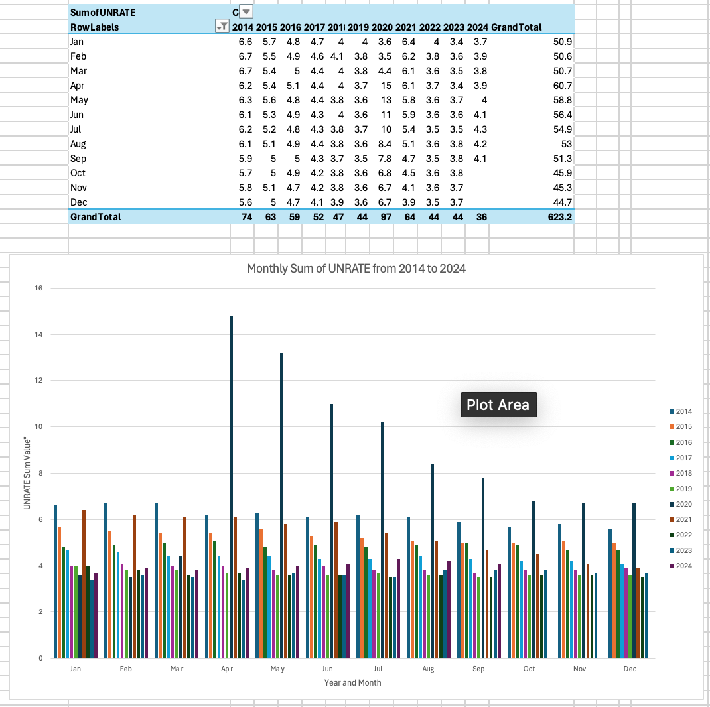

### 4.Monthly UNRATE Sum Across All Year

#### Overview

The unemployment rates from January to December sum up to a total of 623.2. This analysis reviews monthly trends, identifying peaks and seasonal patterns.

##### Key Insights

**Peak Unemployment Rates:**

April shows the highest unemployment rate at 60.7. This spike may reflect seasonal employment dynamics or broader economic challenges. May and June follow closely, indicating continued difficulties in the labor market during the spring months.

**Lowest Unemployment Rates:** December has the lowest rate at 44.7, suggesting a typical end-of-year recovery as seasonal hiring increases for the holidays. October and November also show lower rates, reinforcing the idea of recovery and stabilization leading into the new year.

**Seasonal Trends:** The data indicates a seasonal pattern where unemployment rates are generally higher in the early part of the year (January through April) and lower towards the end (October through December). This trend may reflect various factors, including seasonal employment opportunities and economic conditions.

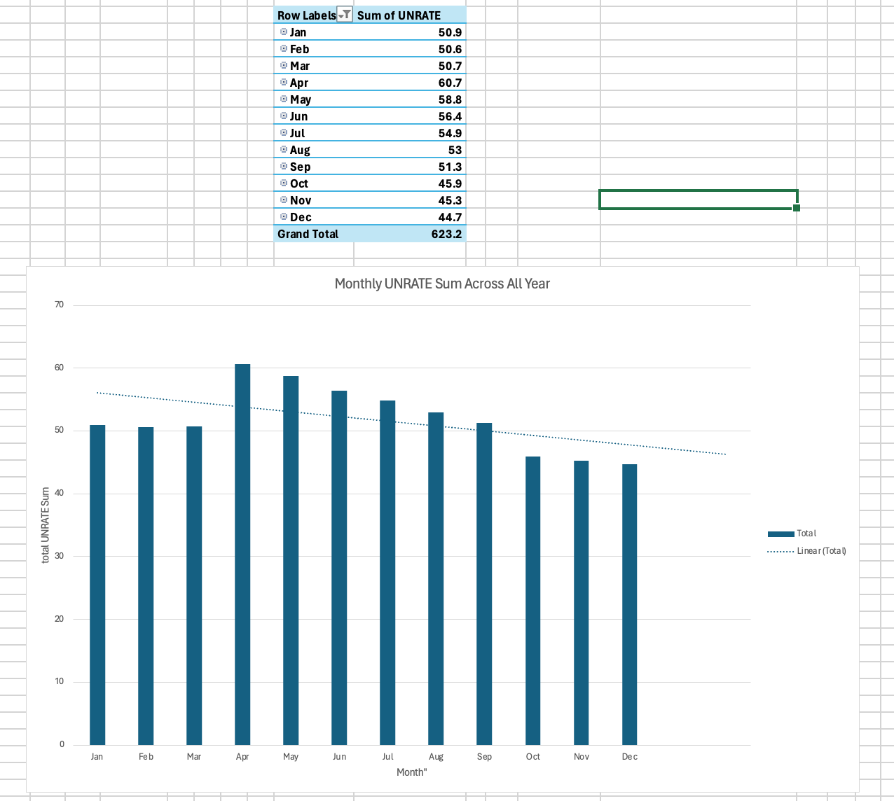

### 5.Distribution of UNRATE Count by Value and Year"

#### Overview

The dataset includes observations of unemployment rates across various years. Below is a detailed breakdown of the counts for each unemployment rate value.

#### Insights

**Frequency of Rates:**

The unemployment rates range from 3.4% to 14.8%, with the most common rate at 3.6% (15 observations). Other frequent rates include 3.5% (7 observations) and 3.8% (12 observations), indicating a strong job market during those periods.

**High Unemployment Rates:** Rates above 10% are rare, with only a few instances (e.g., 10.2%, 11%, 14.8%), suggesting significant economic distress during those times. **early and Monthly Trends** Years like 2019 and 2022 show low unemployment rates, reflecting economic stability. The rise in 2023 rates indicates potential economic challenges.

**Seasonal Patterns:**

Certain months (e.g., January, April, December) show a concentration of lower rates, likely linked to seasonal hiring trends.

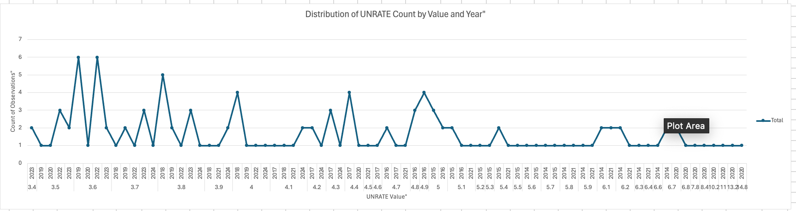

### Employment

### 1.Monthly Sum of CE16OV from 2014 to 2024"

#### Overview

The provided employment data covers monthly figures labeled as "CE16OV" from January 2014 to December 2024. Each row corresponds to a year, showing monthly employment values that indicate trends in the labor market. The total employment for the entire period sums to 9022.54, with individual monthly values reflecting both seasonal patterns and longer-term trends.

#### Insights

**Overall Employment Growth:**

The grand total of employment rates over the period is 9022.54. The data reflects a general upward trend in employment rates from 2014 to 2019, with an average annual increase.

**Peak Employment Years:**

The highest annual employment rates were recorded in 2019 (856.19) and 2023 (863.19), indicating a robust labor market before and after the pandemic.

**Impact of the COVID-19 Pandemic:**

2020 shows a sharp decline in employment rates, particularly in April (60.17) due to the pandemic. This year marks a significant downturn, with a total of 804.10. Recovery begins in 2021, with gradual increases each month, but the employment rates remain below the pre-pandemic peak.

**Post-Pandemic Recovery:**

Employment rates steadily rise from 2021 to 2023, reflecting resilience in the job market. By 2024, the monthly rates are still lower than the highs of previous years but show signs of stabilization.

**Monthly Patterns:**

Consistently higher employment rates are observed in the latter months of the year (particularly November and December), likely due to seasonal hiring trends during holiday periods. January typically starts with lower employment figures, reflecting post-holiday layoffs or reduced hiring.

**Fluctuations:**

Monthly data reveals fluctuations in certain months, particularly in 2020, where employment levels drop significantly.June and July often show variability, suggesting a potential correlation with summer employment patterns or seasonal hiring practices.

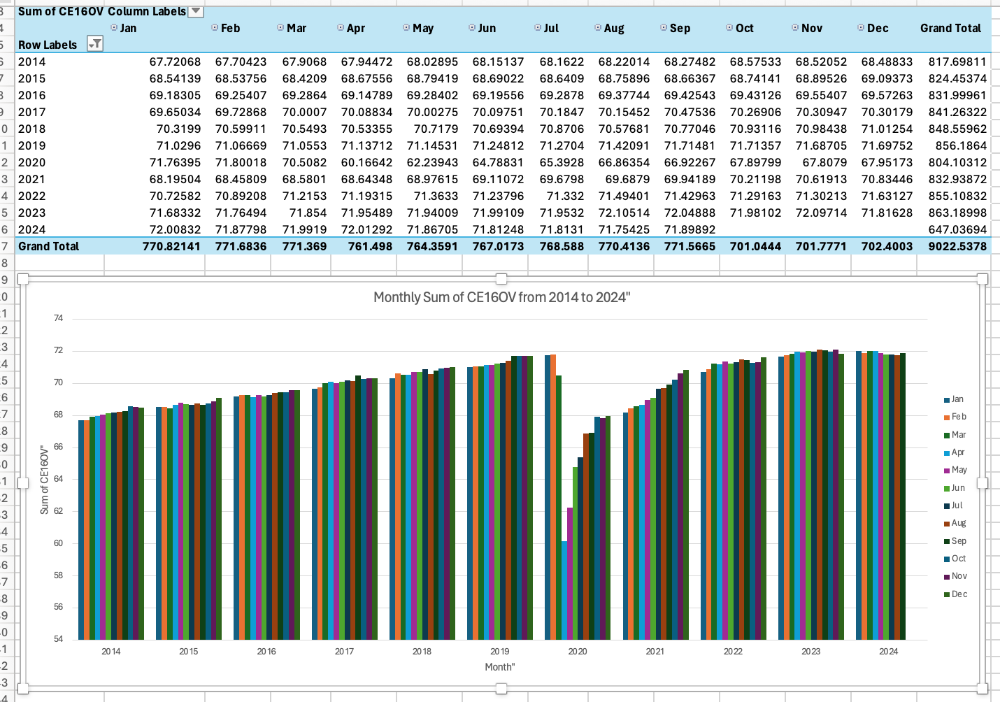

### 2 Annual Sum of CE16OV from 2014 to 2024

#### Overview

The employment rates, represented by the Sum of CE16OV, reflect the overall state of employment in the analyzed region from 2014 to 2024.

#### Insights

**General Trend:**

The employment rates show a general upward trend from 2014 to 2019, peaking in 2023 at 863.19. This indicates a healthy labor market prior to the pandemic.

**Pandemic Impact:**

A significant drop occurred in 2020 (to 804.10), highlighting the adverse effects of the COVID-19 pandemic on employment levels.

**Recovery Post-Pandemic:**

After the dip in 2020, employment rates began to recover, with 2021 showing a rebound to 832.94 and further growth in 2022 and 2023. However, the recovery remains incomplete as 2024 shows a sharp decline to 647.04.

**Seasonal Patterns:**

The consistent increase in employment figures from 2014 to 2019 suggests stable growth, while the fluctuations in 2024 might indicate ongoing challenges in the labor market. **Comparative Stability:**

Despite the significant downturn in 2020, the years 2021, 2022, and 2023 demonstrate recovery and stability, reinforcing the resilience of the labor market.

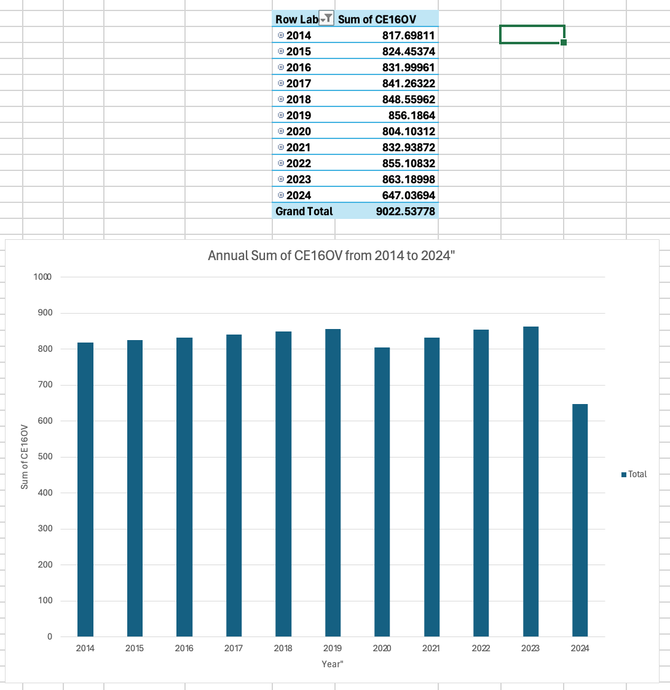

### 3. Sum of CE16OV" for each year.

#### Overview

This analysis examines the monthly employment rates, represented by the Sum of CE16OV, across the years 2014 to 2024. The data provides insight into employment trends and fluctuations throughout the years.

#### Insights

**2014-2019: Steady Increase**

Monthly Trends: Each month experienced a gradual increase in employment rates over these years. For instance, January 2014 started at 67.72, and by January 2019, it had risen to 71.03. Peak in 2019: The employment rate in 2019 consistently remained above 71 for most months, indicating a strong labor market. The highest monthly rate in 2019 was in December at 71.70.

**2020: Significant Decline**

Impact of COVID-19: The data reflects a dramatic drop in April 2020, where the employment rate plummeted to 60.17. This decline was driven by the economic effects of the pandemic, leading to layoffs and job losses.

**Year-End Recovery:**

Despite a recovery in subsequent months, the total for 2020 was 804.10, showing a substantial reduction from the previous years.

**2021-2023: Recovery Phase**

Gradual Recovery: The employment rate began to recover in 2021, rising back to 832.94 by the end of the year. Monthly rates showed improvements across all months, although they remained below pre-pandemic levels.

**Peak in 2023:**

The highest employment rate recorded was in 2023, with a grand total of 863.19. Monthly figures surpassed 72 for several months, indicating a stronger labor market compared to previous years. **2024: Decline in Employment Rates**

Drop in January-March: In 2024, the data shows a decline in employment rates, starting at 72.01 in January and gradually dropping to 71.75 by August. The total for the year so far is 647.04, which is considerably lower than the previous years, indicating potential challenges facing the job market.

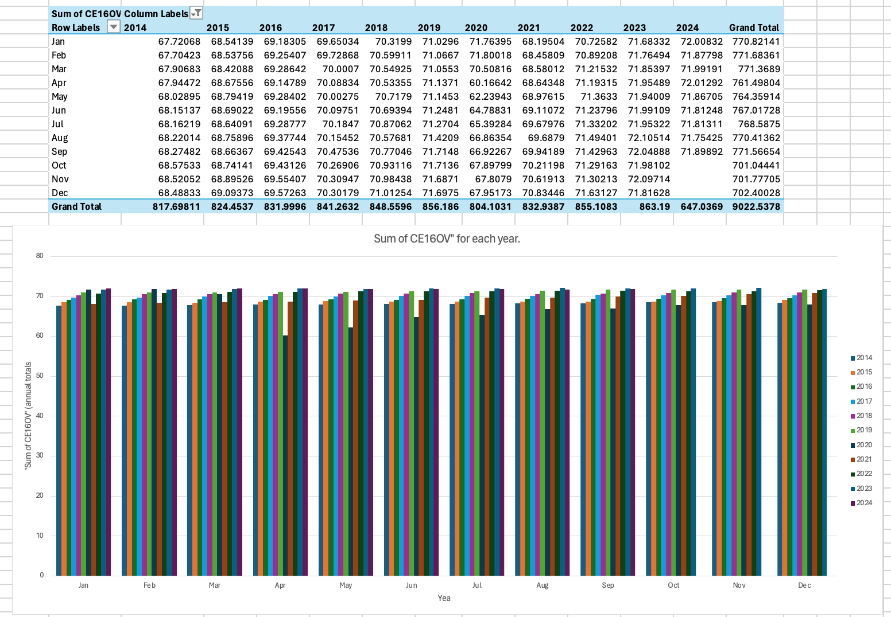

### 4. Monthly Sum of CE16OV Values

#### Overview

This summary provides an analysis of the monthly employment rates (Sum of CE16OV) across the year, showcasing trends and significant observations.

#### Insights

**Early Year Performance:**

The employment rates are relatively high at the beginning of the year, particularly in January (770.82) and February (771.68). This stability is often associated with post-holiday hiring and strong economic activity. Employers may be replenishing staff after seasonal fluctuations, indicating robust confidence in the economic outlook.

**Mid-Year Stability:**

From March (771.37) through August (770.41), the employment rates maintain a generally high level, reflecting a steady job market. This period typically aligns with spring and summer hiring, as businesses look to capitalize on increased consumer spending and seasonal demands.

**Seasonal Variation:**

The April to August months show minor fluctuations, with April experiencing a dip to 761.50. This drop could be indicative of seasonal employment changes, as businesses may reduce hiring in anticipation of slower demand. However, the subsequent months see a recovery, demonstrating resilience in the job market.

**Fall Decline:**

A sharp decline occurs in October (701.04), marking the lowest employment rate of the year. This decrease may correlate with the end of the summer hiring season, leading to layoffs or reduced hiring in preparation for the holiday season. Employers may reassess their workforce needs, reflecting broader economic uncertainties.

**Late-Year Challenges:**

The low employment figures persist into November (701.78) and December (702.40), suggesting a challenging end to the year. The consistent low rates could signal concerns regarding economic conditions or shifts in labor market dynamics. Additionally, these months often see seasonal fluctuations, where many temporary positions are filled but may not lead to sustained employment.

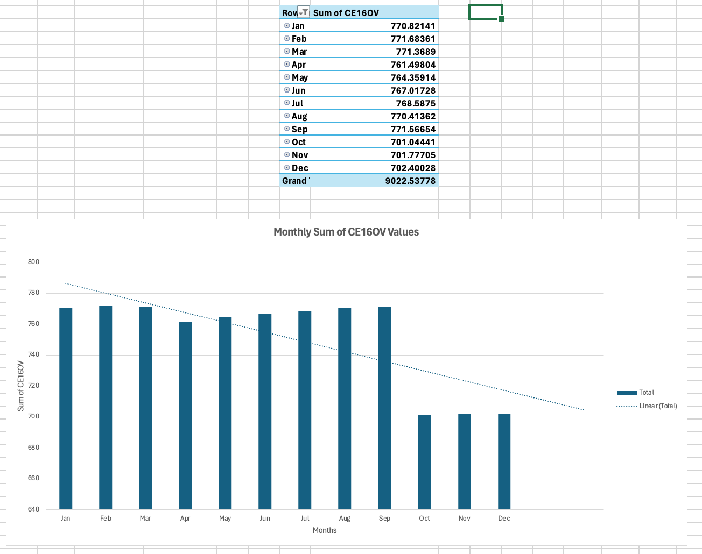

### 1. Comparison between Unemployment and Employment Rates

#### Overview

The dataset contains monthly unemployment and employment rates from January 2014 to September 2024. This period encompasses significant economic events, including recovery from the Great Recession, the impact of the COVID-19 pandemic, and subsequent economic adjustments.

#### Inisghts

**Initial Recovery Phase (2014-2019)**

**Consistent Decline in Unemployment:**

The unemployment rate (UNRATE) gradually declined from 6.6% in January 2014 to 3.5% in September 2019, indicating a robust recovery in the job market. The employment rate (EMRATE) showed a corresponding upward trend, starting at 67.72% and reaching 71.71% by the end of 2019, reflecting increased workforce participation.

**COVID-19 Impact (2020)**

**Dramatic Spike in Unemployment:**

A sharp increase in unemployment occurred in April 2020, where the rate surged to 14.8%. This spike reflects the immediate effects of the COVID-19 pandemic, leading to widespread layoffs and furloughs. The employment rate saw a significant drop, plummeting to 60.17% in April 2020, signaling a substantial contraction in available jobs.

**Gradual Recovery (2021-2023)**

**Decreasing Unemployment:**

After the peak in April 2020, the unemployment rate began to decrease steadily, reaching 3.9% by December 2021. The employment rate recovered as well, peaking at 70.83% in December 2021. Stability and Fluctuations: From early 2022 to mid-2023, both rates exhibited relative stability, with UNRATE fluctuating around 3.5%-4.1% and EMRATE hovering near 71.0%. Notably, the employment rate maintained a positive trend, suggesting sustained recovery in job creation.

**Current Trends (2024)**

**Slight Increase in Unemployment:**

The data indicates a slight uptick in unemployment in early 2024, rising to 4.3% by July 2024. This may reflect ongoing adjustments in the labor market as industries stabilize post-pandemic. Despite the increase in unemployment, the employment rate remained relatively stable, fluctuating between 71.81% and 72.10%, indicating a resilient workforce.

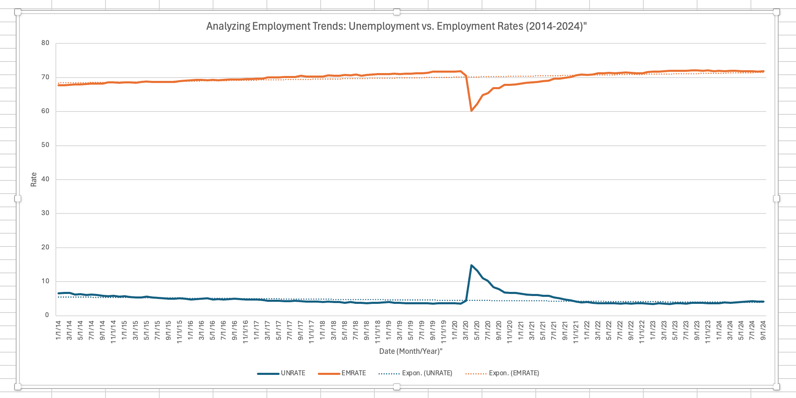

### Conclusion

**This analysis illustrates the significant fluctuations and trends in the unemployment rate from 2014 to 2024. The impacts of economic events, particularly the COVID-19 pandemic, are evident in the data, showcasing a rapid rise in unemployment followed by a gradual recovery. The trends indicate resilience in the labor market, with indications of stability in recent years.**

**Future analysis should continue to monitor these indicators closely, considering potential economic shifts and the ongoing impacts of policy decisions. The insights drawn from this analysis can help inform strategies for addressing unemployment and fostering a more resilient labor market**

## Week 3 - 10/28 ~ 11/4

### 1. Labor Participation Rates

#### General Trend (2004 - 2024)

From 2004 to 2024, the numbers reveal an overall gradual decline with some fluctuations. Starting at a high of around 66.1 in 2004, the values taper down, reaching a low point near 63.1 around 2013-2015, and later stabilizing slightly below this level.

#### Periodic Trends 2004 - 2006:

Fairly stable values at or just above 66.0, with minimal variation. This period shows consistency, with average values remaining between 65.8 and 66.4. 2007 - 2012: A slow, gradual decrease begins, showing a small drop each year. By 2012, values dip into the 63.0s. 2013 - 2016: The period from 2013 to 2016 marks a stabilization around 63.0, showing that the initial decline has leveled off. 2017 - 2019: Minor fluctuations occur, but values generally hold between 62.7 and 63.2. 2020 - 2021: There’s a noticeable decrease during these years, with a low at 60.1 in April 2020, likely influenced by external events or changes. 2022 - 2024: Gradual recovery and stabilization. Values from 62.1 to 62.8 suggest a slight upward trend, signaling a return to pre-2020 levels.

#### Notable Dips and Recoveries

2020 Drop: There’s a significant dip in early 2020, reaching a low of 60.1 in April, possibly indicative of disruptions (potentially related to the COVID-19 pandemic). Post-2021 Recovery: Values begin to rise gradually from mid-2021 onward, climbing back toward 62.8 by 2024.

#### Recent Stability (2022 - 2024)

Starting in 2022, the values show relative stability, remaining within the 62.1 - 62.8 range. This could imply that the earlier volatility has settled, suggesting that the dataset is stabilizing at this new level.

#### Seasonal Fluctuations

Although the data displays annual cycles, the month-to-month changes are minimal, suggesting low seasonal variability. However, some minor dips in late 2008 and early 2009 hint at potential seasonal effects, with values generally lower in winter months.

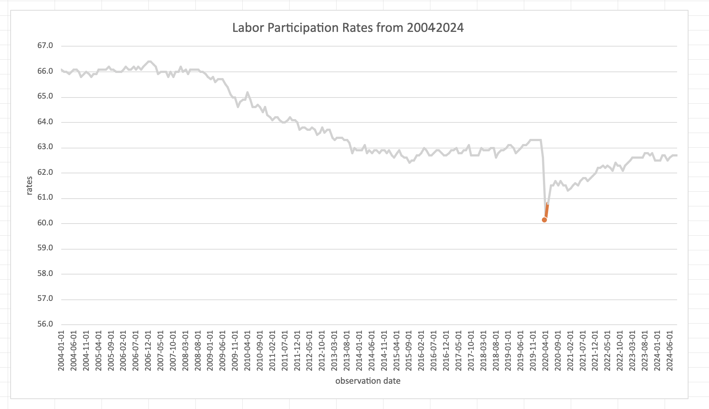

### 2. Overall LPR

#### Trends Over Time:

The data starts at a high average value, peaking at 66.4 in early 2007 and then gradually declines. The lowest recorded value is 60.1 in April 2020, possibly indicating an unusual dip, which may correspond with the onset of the COVID-19 pandemic.

After 2020, the values generally increase, showing signs of gradual recovery, but they don’t return to the initial highs seen before 2010.

#### Central Tendency:

The **median** value is 63.1, close to the overall **average** of 63.8, suggesting that the dataset is fairly symmetric, though with a few notable declines, especially around 2020. This average lies slightly above the midpoint between the maximum (66.4) and minimum (60.1), implying a slight skew toward higher values but balanced by the years of lower measurements around the 2020 period.

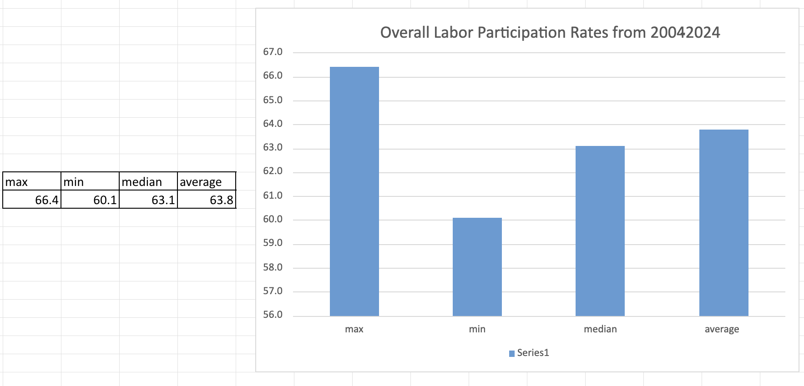

### 3. Men LPR

##### General Trend

The male labor force participation rate has experienced a **gradual overall decline** from approximately 73.7% in 2004 to around 68.2% in recent years. This steady decline reflects broader shifts in the workforce, influenced by demographic factors such as aging, increased schooling, and changing job market dynamics.

##### Notable Dips and Recoveries

**2008 Financial Crisis**: The 2008 recession marks a significant dip in participation, with male labor force involvement dropping from around 73% to 71% between 2008 and 2009. Post-recession, the recovery was slow, and participation did not fully rebound, indicating long-term structural changes.

**COVID-19 Pandemic (2020)**: The COVID-19 pandemic led to one of the most dramatic drops in male participation, falling sharply from 69.2% in February 2020 to about 66% by April 2020. This sudden drop was due to widespread lockdowns and economic uncertainty. While there was some recovery from 2021 onward, pre-pandemic levels have not yet been restored.

##### Recent Stability

Since 2021, labor force participation among men has shown signs of **stabilization**, with rates hovering around 68% in 2023 and 2024. This stability, although lower than in previous years, indicates a potential new normal in male workforce engagement, reflecting shifts brought about by the pandemic and economic adjustments.

##### Seasonal Fluctuations

The data shows **seasonal fluctuations** in male labor force participation, often peaking in the spring and summer months and dipping in the winter. This seasonal pattern likely reflects job trends in certain sectors like construction, retail, and tourism, which see higher activity in warmer months and around holiday seasons.

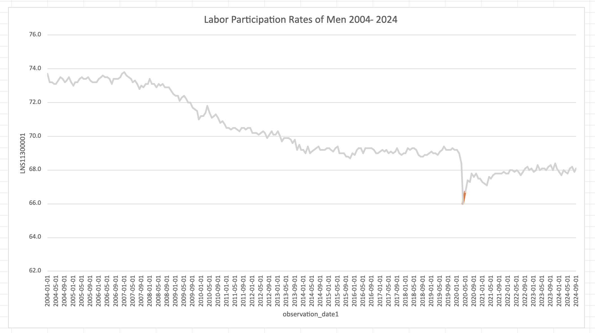

### 4. Overall Men LPR

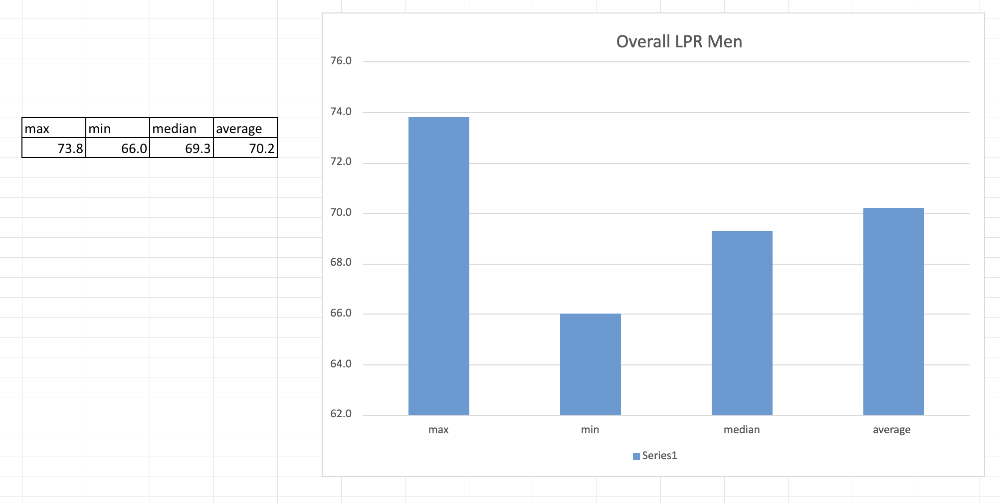

#### Trends Over Time

**Initial Highs and Decline**: Starting with a high participation rate of **73.8%**, stability was initially strong but then declined, especially after economic downturns like the 2008 recession and the COVID-19 pandemic in 2020, which saw rates fall to **66.0%**

**Recent Stabilization**: Following the pandemic, rates have stabilized near the **69.3%** median, indicating a recovery as the labor market adapted to new conditions.

#### Central Tendency

**Median (69.3%)** and **Average (70.2%)**: These values reflect that while there were notable dips, participation rates consistently centered around 70%, highlighting resilience despite economic shifts.

### 5. Women LPR

##### General Trend

**Long-Term Decline:** The initial years from 2004 to 2015 saw a steady decrease in participation rates, indicating challenges for women in the workforce during that period, including potential factors such as economic downturns and shifts in job availability.

**Gradual Recovery:** Post-2015, the participation rate began to recover slowly, reaching a peak of 57.9% in early 2020 before the pandemic caused a sharp decline.

##### Notable Dips and Recoveries

**Significant Dip in 2020:** There was a sharp decline in April 2020, dropping to 54.6%, which correlates with the onset of the pandemic and widespread job losses.

**Slow Recovery Post-Pandemic:** After the initial drop, the labor force participation rate for women showed a gradual recovery, with figures improving to 57.6% by late 2021. However, the recovery has been slow and inconsistent compared to pre-pandemic levels.

##### Recent Stability

**Stabilization Around Mid-50s:** By 2023, the participation rate has stabilized in the range of 57% to 57.6%, suggesting a return to pre-pandemic participation levels, albeit not to the higher levels seen in the early 2000s.

**Slight Variability:** There is some slight variability month-to-month, but rates have remained consistent within this range, indicating that the labor market for women may have found a new equilibrium.

##### Seasonal Fluctuations

**Monthly Variability:** Throughout the years, there have been minor seasonal fluctuations, often reflecting typical economic cycles, but these variations are less pronounced compared to the larger trends observed during significant economic events, like the pandemic.

**No Major Seasonal Patterns Identified:** While month-to-month changes occur, no distinct seasonal pattern is evident in the data over the years; fluctuations seem more influenced by broader economic conditions rather than regular seasonal trends.

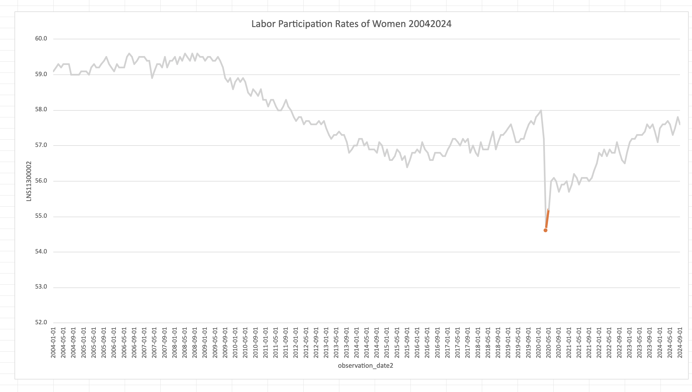

### 6. Overall Woman LPR

##### Trends Over Time

The labor force participation rate for women has experienced fluctuations, reflecting the impact of economic conditions, social factors, and policy changes. Initially, the rate showed an upward trend, indicating increased opportunities for women in the workforce. However, recent data reveal a decline, particularly during economic downturns.

The rate peaked at 59.6%, signaling strong participation likely linked to economic booms. Conversely, it fell to a minimum of 54.6%, with notable dips during significant events such as the COVID-19 pandemic, which led to substantial job losses among women. Recovery periods can be observed following economic stimulus and policy changes aimed at reintegrating women into the workforce.

Currently, the participation rate appears stabilized around the average of 59.6%, indicating a possible recovery phase. However, this stability aligns with the maximum, suggesting that significant fluctuations persist.

##### Central Tendency

The central tendency of women’s labor force participation rates reveals key insights into their workforce presence. The mean (average) rate is 59.6%, indicating consistent engagement, especially during periods of economic growth. In contrast, the median rate of 54.6% shows that at least half of the recorded rates were lower, suggesting significant impacts from adverse economic conditions on women's participation.

The minimum rate, also at 54.6%, indicates a threshold for participation, with its convergence with the median highlighting systemic barriers women face in the labor market. Meanwhile, the maximum rate of 59.6% serves as an aspirational benchmark for future policies aimed at enhancing women's workforce engagement, emphasizing the potential for growth and the need to address ongoing challenges.

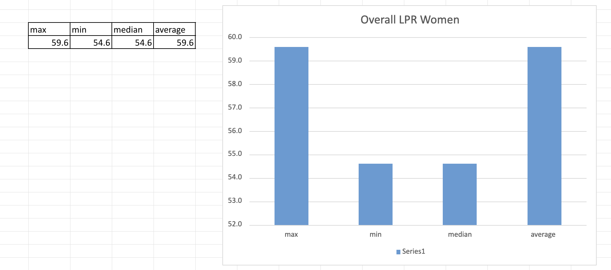

### 7. Comparison Between Overall, Men , Women LPR

##### Overall Labor Participation Rates

The overall labor participation rate demonstrates a maximum of **66.4%**, reflecting peak engagement in the workforce. The minimum rate of **60.1%** indicates a lower threshold, while the **median** of **63.1%** shows that half of the recorded rates fall below this level, providing a balanced view of workforce participation. The **average** participation rate is **63.8%**, suggesting consistent participation with minor fluctuations.

##### Men’s Labor Participation Rates

For men, the labor participation rate peaks at **73.8%**, with a minimum of **66.0%**. The **median** rate is **69.3%**, indicating a robust presence in the workforce, while the **average** of **70.2%** highlights sustained engagement, reflecting economic conditions that generally favor male participation.

##### Women’s Labor Participation Rates

Women’s labor participation shows a maximum of **59.6%** and a minimum of **54.6%**, with both the **median** and **minimum** rates aligning at **54.6%**. This convergence suggests challenges women face in maintaining consistent participation levels. The **average** of **59.6%** indicates periods of strong engagement, yet also underscores significant fluctuations influenced by economic downturns and social factors.

##### Summary of Comparison

The stark difference between men’s and women’s labor participation rates highlights ongoing challenges and inequalities in the workforce. While both genders exhibit some level of fluctuation, men's participation remains notably higher and more stable, reflecting traditional employment dynamics. In contrast, women's labor participation is subject to greater variability, influenced by external factors and economic conditions. Addressing these disparities is crucial for promoting gender equity and enhancing workforce participation for women.

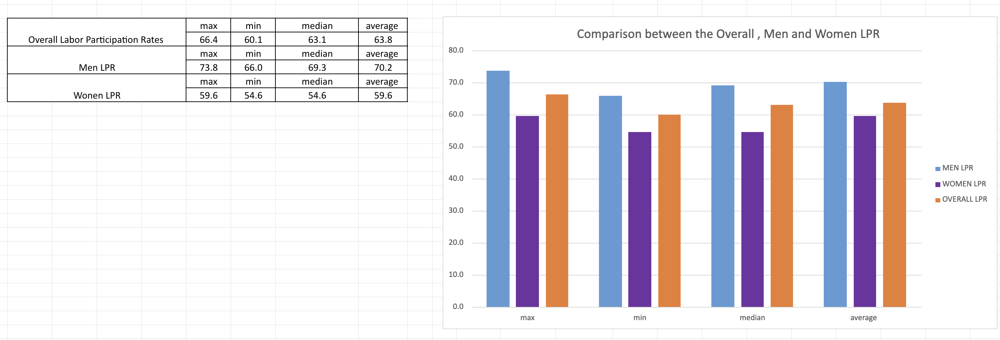